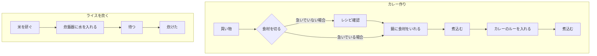

```mermaid
flowchart TD

subgraph カレー作り
a1[買い物]-->a2{食材を切る}
a2-->|急いでいない場合|a3[レシピ確認]-->a4[鍋に食材をいれる]
a2-->|急いでいる場合|a4
a4-->a5[煮込む]-->a6[カレーのルーを入れる]-->a7[煮込む]
end

subgraph ライスを炊く
b1[米を研ぐ]-->b2[炊飯器に水を入れる]-->b3[待つ]-->b4[炊けた]
end
```

```mermaid
graph TD;
    A-->B;
    A-->C;
    B-->D;
    C-->D;
```